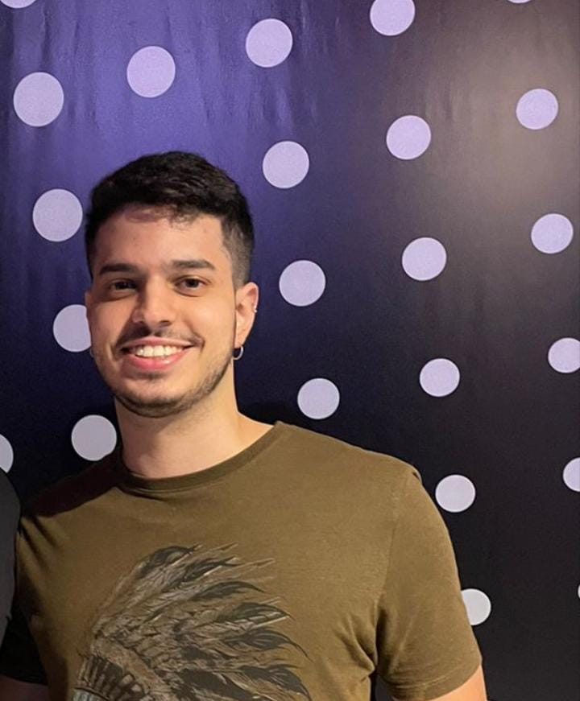
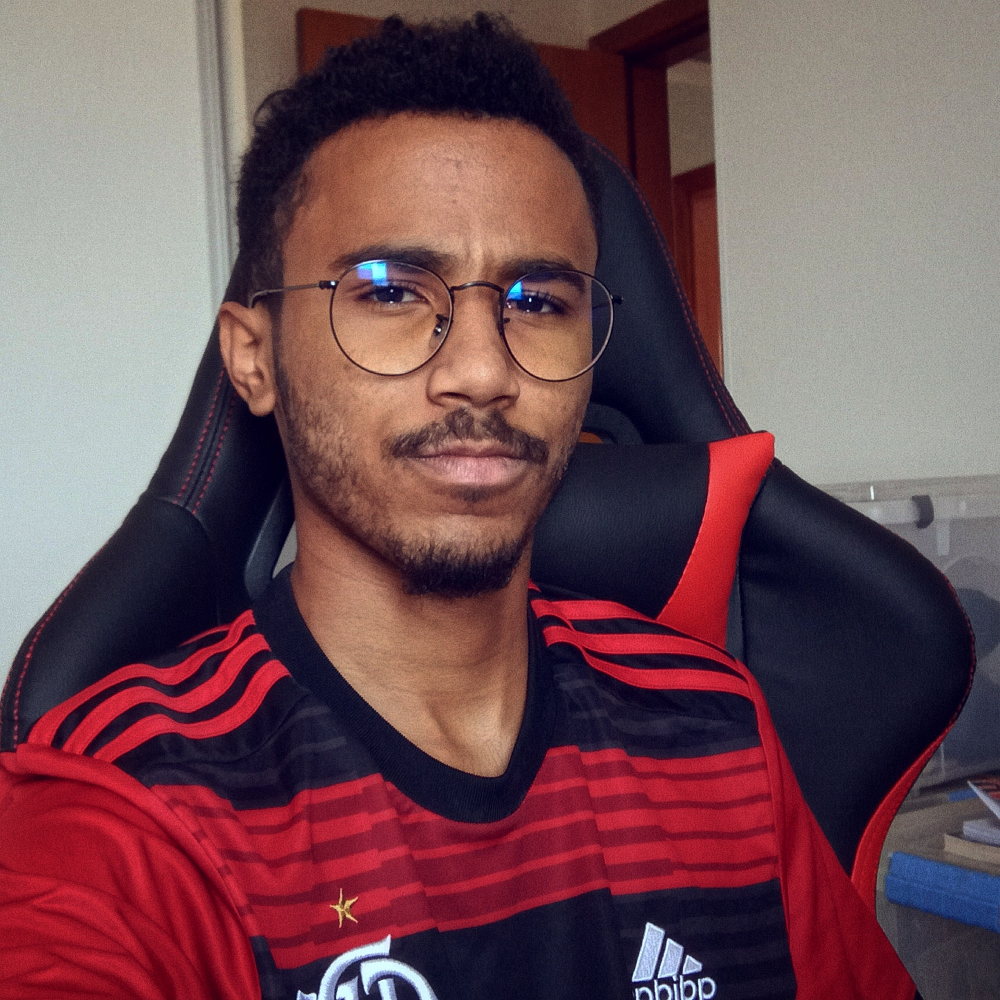

# Projeto da disciplina de Interação Humano Computador UnB 2022/2
## Objetivo
Esse projeto propõe a utilização das técnicas e recursos de IHC para propor alterações de design, navegação e ferramentas em sites de domínio público, de forma a contribuir de maneira geral para a experiência de usuário quanto a usabilidade de um site.
## Equipe
|Foto|Membro|Github|
|----|------|------|
||Artur Seppa Reiman|[@artur-seppa](https://github.com/artur-seppa)
||Eric Chagas de Oliveira|[@Eric-chagas](https://github.com/Eric-chagas)
||Henrique Galdino Couto|[@hgaldino05](https://github.com/hgaldino05)
||Igor Silva de Paiva|[@IgorSPaiva](https://github.com/IgorSPaiva)
|----|Pedro Menezes Rodiguero|[@pedro-rodiguero](https://github.com/pedro-rodiguero)
||Thiago Cerqueira Borges|[@Thiago-Cerq](https://github.com/Thiago-Cerq)
