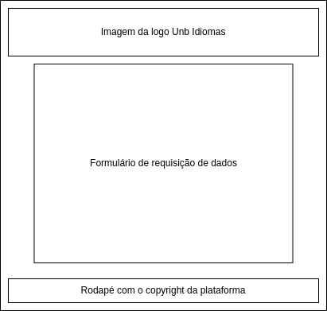

# Guia de Estilo

Trata-se de um documento que contempla as diretrizes de design tomadas em um produto ou projeto, estipulado as regras de design a serem incorporadas por toda a equipe de design e de desenvolvedores. Documentando o design de tipografia, cores, grids, breakpoints e entre outros.

## 1. Introdução

O objetivo deste guia é descrever as decisões de design tomadas no site Unb idiomas, abordando sobre as diretrizes utilizadas na página inicial, módulo de cadastro de usuário, página corporativa, de chamada pública e de contatos. Viabilizando, dessa forma, a consulta das decisões de guia de estilo e prototipação de melhorias.

## 2. Resultados de Análise
 O site da UnB Idiomas foi análisado em vários aspectos, como interface, usabilidade e design, com o intuito de assegurar que as expectativas dos usuários é atendida. 

#### 2.1: Descrição do ambiente de trabalho do usuário
Na página inicial do site são encontrados: 

- Um cabeçalho contendo os logos da UnB Idiomas, da Universidade de Brasília, do Instituto de Letras da UnB e do LET.
- Um botão "Portais", onde os usuários que possuem cadastro podem acessar os portais de seu uso.

- Uma barra de navegação, na qual o usuário pode acessar informações sobre normas, contatos, cadastro, etc.

- Um "mural", composto por uma imagem no formato png, no qual são encontrados avisos importantes.

- Três menus divididos em "blocos", nos quais os usuários podem acessar informações referentes aos cursos oferecidos, informes e destaques. 

- Um rodapé contendo atalhos para seções referentes a informações da UnB Idiomas, propostas e projetos parceiros.

## 3. Elementos da interface

**3.1. Disposição espacial e grid**

Como elementos de disposição espacial, o sistema utiliza grids no HTML para a exercer a configuração de layout das páginas, existindo ao todo 4 modelos de grids do sistema:

**3.1.1. Homepage**

A home page é caracterizada como simples, sendo composta por uma aba de navegação na parte superior, no qual viabiliza o acesso as outras páginas do sistema, além de ter, ao longo da sua estrutura, um carrosel de informativos em imagens, links com os cursos ofertados pela plataforma, informativos em texto sobre os cursos, destaques do sistema e um rodapé com links de acesso a outras páginas do Unb Idiomas. Podendo ser evidenciado o grid na figura 1: 

<figcaption align='center'>
 <h6> <b>Figura 1 – Imagem de exibição de grid da página</b> 
  Fonte: Autores</h6>
</figcaption>
 

**3.1.2. Cadastro de Usuário**

Presente na aba de cadastro pode ser evidenciado um formulário de preenchimento com a requisição de informações pessoais dos usuários da Unb Idiomas. (Figura 2)

<figcaption align='center'>
 <h6> <b>Figura 2 – Imagem de exibição de grid da página</b> 
  Fonte: Autores</h6>
</figcaption>
 

**3.1.3. Página Coorporativa, Sobre a Instituição, Solicitação de Proposta de Curso, Projetos Violes e Funap**

As páginas citadas acima detém do mesmo layout de disposição espacial, havendo ou não a presdisposição de um button na parte inferior para ter acesso a um fórmulario de solicitação de proposta de curso. Sendo evidenciado na figura:

<figcaption align='center'>
 <h6> <b>Figura 3 – Imagem de exibição de grid da página</b> 
  Fonte: Autores</h6>
</figcaption>
 

**3.1.4. Página de Chamada pública, Contatos e Equipe**

Obtém o mesmo layout de disposição de grid, havendo a predisposição de buttons informativos sobre a plataforma. 

<figcaption align='center'>
 <h6> <b>Figura 4 – Imagem de exibição de grid da página</b> 
  Fonte: Autores</h6>
</figcaption>
 

### 3.2 Tipografia

A tipografia do site utiliza três fontes principais, sendo elas:

- Droid Sans
- Liberation Sans
- Helvetica

A fonte predominante do site é a Droid Sans, obtendo no button de portais de acesso a utilização da fonte Helvetica, além de haver uma muda de diretriz de design na página de Chamada Pública, tendo links de acessos a outras páginas alocadas com fonte Liberation Sans.

### 3.3 Simbolos não tipografados

A plataforma faz uso dos simbolos não tipografados:

Descrição   | Imagem
--------- | ------
Icone 5 | 
Icone 6 | 
Icone 7 | 
Icone 8 | 

### 3.4 Cores

As cores utilizadas em todo o site seguem o padrão de cores do símbolo da Unb Idiomas, havendo-se algumas variações delas, como mostra a figuras 9.

<figcaption align='center'>
 <h6> <b>Figura 9 – paleta de cores utilizadas na página</b> 
  Fonte: Autores</h6>
</figcaption>
 

### 3.5 Animações
O site não possui animações.

## 4. Elementos de interação

**4.1 Estilo de interação**
O site é composto, em sua maioria, por botões, menus e links, sendo que estes últimos levam a áreas diferentes do site ou a arquivos *.pdf* contendo informações sobre cursos, normas e etc.

As interações do usuário com o site são feitas através dos elementos listados acima, com o foco no acesso as áreas ou informações desejadas pelo mesmo.

**4.2 Seleção de estilo**
O site exibe seus elementos e informações de maneira clara, apresentando uma interface simples, porém antiquada em comparação a outras plataformas similares.

**4.3 Aceleradores (Teclas de atalho)**
O site não apresenta nenhum acelerador ou comandos/teclas de atalho que auxiliem na navegação.

## 5. Elementos de ação

### 5.1. Preenchimento de campos
Os campos de preenchimento que aparecem por todo o site, devem ser preenchido manualmente, não existe a opção de preenchimento automático.

### 5.2. Acessos
Alguns acessos são bloqueados no site, requisitando a validação de creedenciais para fazer o uso restrito de páginas de aluno, professor, e Neppe. Assim como de ter acesso a questões de disponibilidade, como se inscrever a cursos ofertados pela plataforma.

### 5.3. Ativação
O usuário detém de certas limitações no site,necessitando estar logado para ter acesso completo as funcionalidades disponíveis.

## 6. Vocabulário e padrões

**6.1 Terminologia**
O vocabulário utilizado no site é formal, prezando pela boa compreensão do leitor. Alguns do termos presentes podem ser de menor entendimento para uma parcela dos usuários, principalmente aos que contém um conhecimento raso no que diz respeito a linguagem tecnológica e universitária, sendo eles:

- *PDF* : se refere ao formato de arquivo *.pdf*, utilizado principalmente em documentos. No site é encontrado na aba "Destaques", onde o usuário pode acessar certos documentos neste formato. 

- *WORD* : se refere ao formato de arquivo *.docx*, utilizado principalmente em documentos, cuja forma de acesso principal é o programa *Microsoft Word*. No site é encontrado na aba "Destaques", onde o usuário pode acessar certos documentos neste formato.

- *PES/PESES* : se refere ao *Projeto de Estágio Supervisionado (PES)* e ao *Projeto de Estágio Supervisionado de Espanhol (PESES)*, que compõem o Programa Permanente de Extensão UnB Idiomas, do Departamento de Línguas Estrangeiras e Tradução (LET), da Universidade de Brasília.

Situada abaixo, a figura 10 apresenta a área onde esses termos são encontrados no site:

                                                                      Figura 10 - destaques da homepage do site UnB Idiomas [¹](#ancora1)           

**6.2 Sequências de diálogos (para Feedback ou confirmação de operação)**
 Foram encontradas sequências de diálogos somente para a efetuação de login, na ocasião em que o usuário errar seu CPF ou senha, conforme mostrado na figura 11, situada abaixo:
 
  Figura 11 - aviso login inválido do site UnB Idiomas [¹](#ancora1)           
## Referências
> - [1] Unb Idiomas. Acesso em: 20 de nov. de 2022. Disponível em: <http://www.unbidiomas.unb.br>

## Histórico de versões
|    Data    | Versão |                                       Descrição                                       |        Autor(es)        |         Revisor(es)         |
| :--------: | :----: | :-----------------------------------------------------------------------------------: | :---------------------: | :---------------------: |
| 9/12/2022 |  1.0   |                   Criação da página da entrega 3                           |   Henrique Galdino Couto    | Artur, Eric,  Igor, Pedro, Thiago |
| 12/12/2022 |  1.1   |                                 Elaboração da Introdução, Elementos da Interface e Elementos de ação                            |   Artur Seppa Reiman    | Henrique, Eric,  Igor, Pedro, Thiago |
| 12/12/2022 |  1.2   |                                 Elaboração dos Resultados de Análise, Elementos de Interação e Vocabulários e padrões                            |   Henrique Galdino Reiman    | Artur, Eric,  Igor, Pedro, Thiago |

###### Tabela ? - Histórico de versões. Fonte: Autoria própria