# Perfil do Usuário 

## Introdução

Parte importante do desenvolvimento do projeto para efetuar o levantamento de dados e assim uma descrição detalhada das características dos usuários. Sendo identificado informações de interesse, experiência, nível de instrução, faixa etária etc.

## Metodologia

Como metodologia foi elaborado um questionário no Google Forms com 22 questões a respeito dos usuários, abordando questões demográficas, relacionadas com a Universidade de Brasília e com a usabilidade do site. Além disso, um termo de consentimento foi definido, seguindo as normas da resolução Nº 466 de 12 de Dezembro de 2012, a fim de realizar uma correta e ética coleta de informações dos usuários no sistema. Este questionario foi divulgado de forma livre no Distrito Federal e entorno, atendendo as comunidades internas e externas da Universidade de Brasília, nos quais o produto busca atender. As respostas dos participantes foram coletadas entre os dias 5/12 e 7/12.

 

Para mais informações, acesse o [questionário](https://docs.google.com/forms/d/e/1FAIpQLSeJifKbcQosPv9t4BfMkaYy_FKBi8WNvywW8TP1q541noZ_hw/viewform?vc=0&c=0&w=1&flr=0).

## Resultados do Questionário

 

Em relação às perguntas temos que na primeira pergunta  1 - Qual é a sua idade, temos os resultados na representação gráfica presente na <i>Figura 1</i>. Podemos notar que, cerca de 94,1% da amostra tem entre 18 a 25 anos e 5,9% dos participantes têm entre 26 e 34 anos.

Em relação às perguntas temos que na primeira pergunta  **1 - Qual é a sua idade?**, temos os resultados na representação gráfica presente na <i>Figura 1</i>. Podemos salientar que, cerca de 94,1% da amostra tem entre 18 a 25 anos e 5,9% dos participantes têm entre 26 e 34 anos.

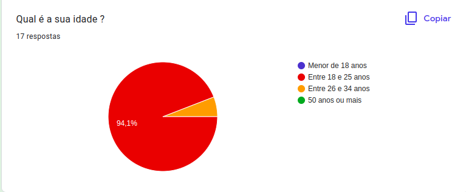
<figcaption align='center'>
 <h6> <b>Figura 1 – Gráfico com o percentual de respostas da questão 1</b> 
  Fonte: Retirada da página de resultados do questionário no Google Forms</h6>
</figcaption>

 

Na segunda pergunta **2 - Qual é seu nível de escolaridade?** 88,2% dos participantes têm o Ensino Superior incompleto e 11,8% têm o ensino médio completo, como mostra a  <i>Figura 2</i>

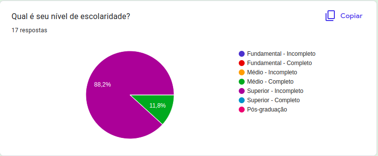
<figcaption align='center'>
 <h6> <b>Figura 2 – Gráfico com o percentual de respostas da questão 2</b> 
  Fonte: Retirada da página de resultados do questionário no Google Forms</h6>
</figcaption>

 

Agora na <i>Figura 3</i> temos a pergunta **3 - Como qual gênero você se identifica?** Que mostra que 29,4% dos participantes marcaram a opção feminino no questionário e 70,6%, a opção masculino.

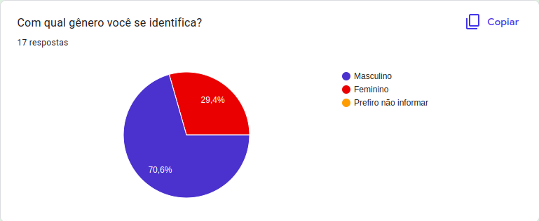
<figcaption align='center'>
 <h6> <b>Figura 3 – Gráfico com o percentual de respostas da questão 3</b> 
  Fonte: Retirada da página de resultados do questionário no Google Forms</h6>
</figcaption>
 

A quarta pergunta : **4 - Qual é a sua ocupação?** 82,4% dos participantes são estudantes. enquanto 11,8% estão empregados e 5,9% são estudante e empregados..<i>(Figura 4)</i>

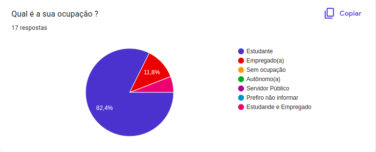
<figcaption align='center'>
 <h6> <b>Figura 4 – Gráfico com o percentual de respostas da questão 4</b> 
  Fonte: Retirada da página de resultados do questionário no Google Forms</h6>
</figcaption>
 

Já na quinta pergunta do questionário, onde foi perguntado: **5. Qual é a sua renda familiar?** Temos os resultados mostrados na <i>Figura 5</i>. Vale ressaltar que esta questão era opcional.

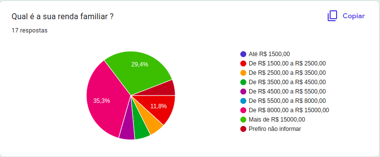
<figcaption align='center'>
 <h6> <b>Figura 5 – Gráfico com o percentual de respostas da questão 5</b> 
  Fonte: Retirada da página de resultados do questionário no Google Forms</h6>
</figcaption>
 

Questão seis do questionário **6 .Qual RA (Região Administrativa) de Brasília você reside ?**, a maioria dos participantes marcaram como primeira opção Águas Claras e como segundo lugar ficou o Guará, sendo possível ver o levantamento de dados no gráfico a partir da <i>Figura 6</i>.

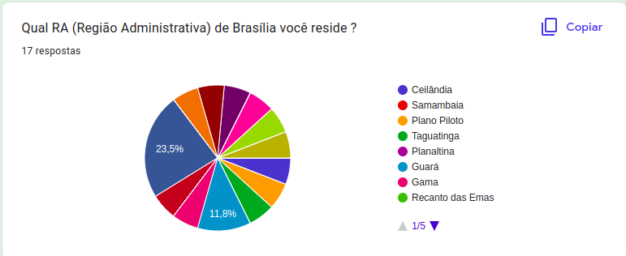
<figcaption align='center'>
 <h6> <b>Figura 6 – Gráfico com o percentual de respostas da questão 6</b> 
  Fonte: Retirada da página de resultados do questionário no Google Forms</h6>
</figcaption>
 

Agora na <i>Figura 7</i> temos **7. Qual é o seu nível de afinidade com tecnologia?** As respostas dos participantes ficaram bem distribuídas como mostrado na figura.

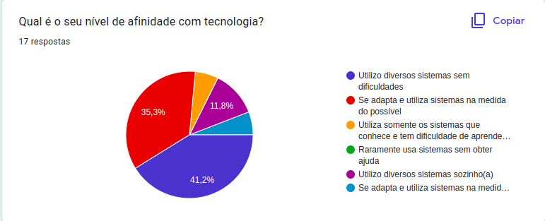
<figcaption align='center'>
 <h6> <b>Figura 7 – Gráfico com o percentual de respostas da questão 7</b> 
  Fonte: Retirada da página de resultados do questionário no Google Forms</h6>
</figcaption>
 

A oitava pergunta : **8 - Você é estudante da Universidade de Brasília ?** A maioria dos participantes do questionário marcaram a opção "sim", com cerca de 82,4%, obtendo 17,6% dos participantes que marcaram não. <i>(Figura 8)</i>

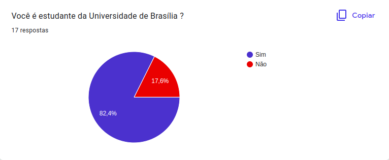
<figcaption align='center'>
 <h6> <b>Figura 8 – Gráfico com o percentual de respostas da questão 8</b> 
  Fonte: Retirada da página de resultados do questionário no Google Forms</h6>
</figcaption>

 

Na nona pergunta **9. Caso seja, informe qual curso você é aluno.** 46,7% dos participantes são do curso Engenharia de Software, enquanto os outros 8 cursos obtiveram 6,7% de alunos. <i>Figura 9</i>.

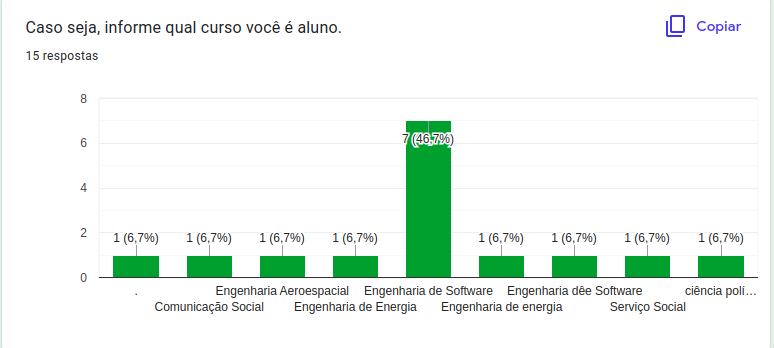
<figcaption align='center'>
 <h6> <b>Figura 9 – Gráfico com o percentual de respostas da questão 9</b> 
  Fonte: Retirada da página de resultados do questionário no Google Forms</h6>
</figcaption>

Para a décima pergunta temos **10. Caso seja, informe em qual campus você estuda (Marque mais opções caso frequente aulas em mais de um campus).** A maioria dos participantes é do campus FGA - Gama como é ilustrado na <i>Figura 10</i>.

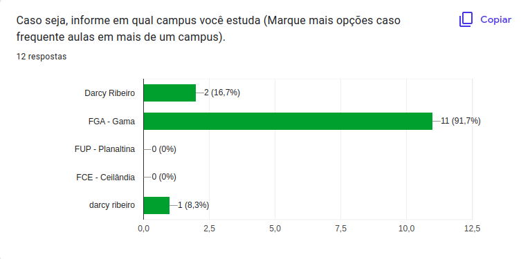
<figcaption align='center'>
 <h6> <b>Figura 10 – Gráfico com o percentual de respostas da questão 10</b> 
  Fonte: Retirada da página de resultados do questionário no Google Forms</h6>
</figcaption>

Agora como mostrado na <i>Figura 11</i> a questão **11. Qual semestre você está cursando?**, ficou com a porcentagem bem dividida, sendo possivel de perceber na figura.

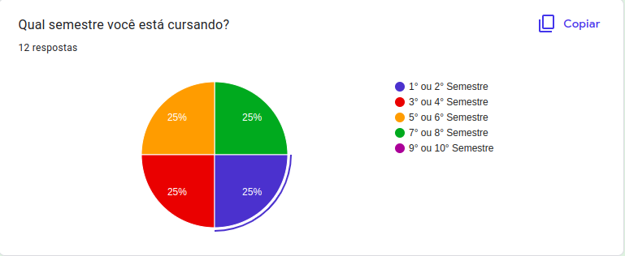
<figcaption align='center'>
 <h6> <b>Figura 11 – Gráfico com o percentual de respostas da questão 11</b> 
  Fonte: Retirada da página de resultados do questionário no Google Forms</h6>
</figcaption>

 

Para a questão 12 onde se é questionado do participante **12. Você já fez uso ou conhece a plataforma Unb Idiomas ?**, segue algumas das respostas, como é mostrado na <i>Figura 12 </i>.

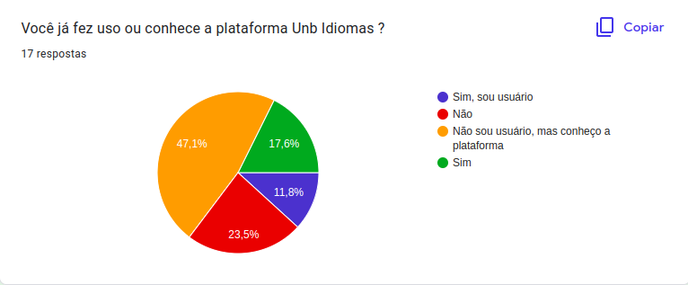
<figcaption align='center'>
 <h6> <b>Figura 12 – Lista das respostas da questão 12</b> 
  Fonte: Retirada da página de resultados do questionário no Google Forms</h6>
</figcaption>

 

Para a décima terceira pergunta **Caso conheça a plataforma, como ficou sabendo de sua existência?** A maioria dos participantes dizem que conheceram sobre a sua existência a partir amigos e conhecidos(<i>Figura 13</i>).

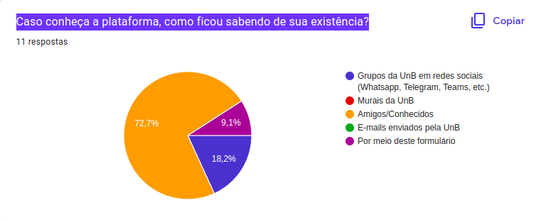
<figcaption align='center'>
 <h6> <b>Figura 13 – Gráfico com o percentual de respostas da questão 13</b> 
  Fonte: Retirada da página de resultados do questionário no Google Forms</h6>
</figcaption>

 

Para a questão 14 onde se é questionado do participante **14. Com que frequência você utiliza o UnB Idiomas?**, metade dos participantes não fazem uso mais do sistema. <i>Figura 14 </i>.

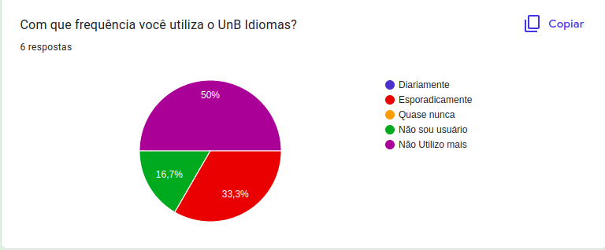
<figcaption align='center'>
 <h6> <b>Figura 14 – Gráfico com o percentual de respostas da questão 14</b> 
  Fonte: Retirada da página de resultados do questionário no Google Forms</h6>
</figcaption>
 

Para a questão 15 onde se é questionado do participante **15. Qual(is) dispositivo(s) eletrônico(s) que você utiliza para ter acesso ao UnB Idiomas?**, segue algumas das respostas, como é mostrado na  <i>Figura 15 </i>.

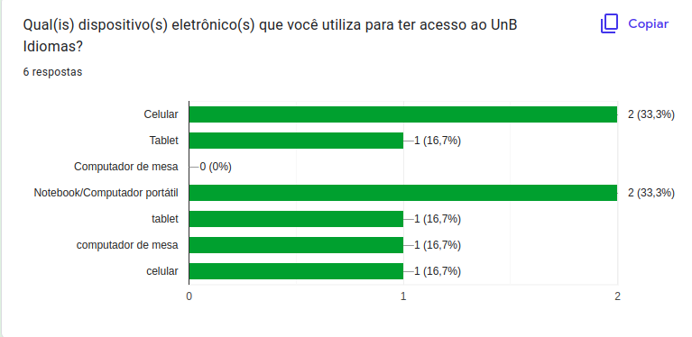
<figcaption align='center'>
 <h6> <b>Figura 15 – Gráfico com o percentual de respostas da questão 15</b> 
  Fonte: Retirada da página de resultados do questionário no Google Forms</h6>
</figcaption>
 

Agora como mostrado na <i>Figura 16</i> a questão **16. Você sente a necessidade ou gostaria que a UnB Idiomas tivesse algum tutorial de como utilizar o site?**, a maioria dos participantes preferem ou sentem a necessidade de ter tutoriais visuais no sistema, com textos e imagens.

<figcaption align='center'>
 <h6> <b>Figura 16 – Gráfico com o percentual de respostas da questão 16</b> 
  Fonte: Retirada da página de resultados do questionário no Google Forms</h6>
</figcaption>
 

Para a questão 17 onde se é questionado do participante **17. Você gosta de explorar todas as funcionalidades que o Unb Idiomas oferece? Ou costuma usar sempre as mesmas?**, 66,7% dos participantes demarcaram que não, sempre fazendo uso das mesmas funcionalidades <i>Figura 17 </i>.

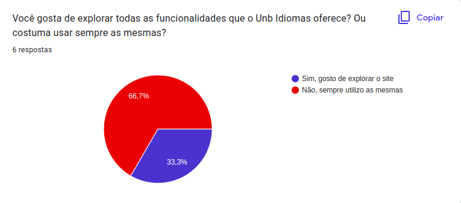
<figcaption align='center'>
 <h6> <b>Figura 17 – Gráfico com o percentual de respostas da questão 17</b> 
  Fonte: Retirada da página de resultados do questionário no Google Forms</h6>
</figcaption>
 

Agora como mostrado na <i>Figura 18</i> a questão **18. O quanto você julga que tem domínio sobre as funcionalidades que o site oferece?**, metade dos participantes determinaram que não possuem dominio nenhum sobre as funcionalidades do site, como visto na figura.

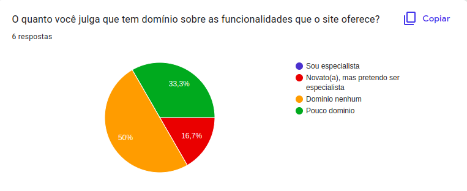
<figcaption align='center'>
 <h6> <b>Figura 18 – Gráfico com o percentual de respostas da questão 18</b> 
  Fonte: Retirada da página de resultados do questionário no Google Forms</h6>
</figcaption>
 

Já na décima nona pergunta do questionário, onde foi perguntado: **19. Durante a utilização do site você já presenciou um erro em alguma função que trouxe algum prejuízo para você?** Temos o resultado mostrado na <i>Figura 19</i>

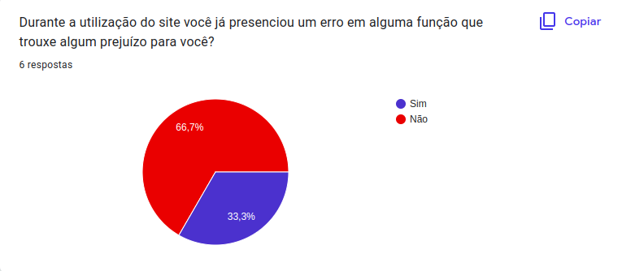
<figcaption align='center'>
 <h6> <b>Figura 19 – Imagem com texto da resposta da questão 19</b> 
  Fonte: Retirada da página de resultados do questionário no Google Forms</h6>
</figcaption>
 

Para a questão 20 se é questionado do participante **20. Você poderia dizer mais sobre essa funcionalidade e sua consequência negativa no uso do site?** Segue a resposta mostrada na <i>Figura 20 </i>.

<figcaption align='center'>
 <h6> <b>Figura 20 – Imagem com texto da resposta da questão 20</b> 
  Fonte: Retirada da página de resultados do questionário no Google Forms</h6>
</figcaption>
 

Para a questão 21 onde se é questionado do participante **21. Você tem alguma sugestão/ideia de melhorias que podem ser feitas no site? Compartilhe-a conosco.** Segue a resposta mostrada na <i>Figura 21 </i>.

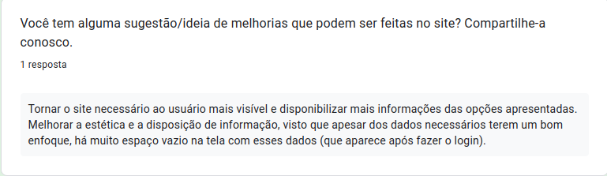
<figcaption align='center'>
 <h6> <b>Figura 21 – Imagem com texto da resposta da questão 21</b> 
  Fonte: Retirada da página de resultados do questionário no Google Forms</h6>
</figcaption>
 

Como introdução do questionário, o participante teve de aceitar o termo de consentimento para continuar na pesquisa. (<i>Figura 23</i>)

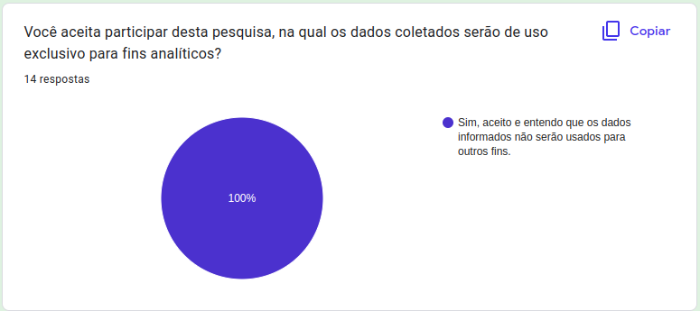
<figcaption align='center'>
 <h6> <b>Figura 23 – Gráfico com o percentual de respostas do termo de consentimento</b> 
  Fonte: Retirada da página de resultados do questionário no Google Forms</h6>
</figcaption>

Na décima segunda pergunta, temos **12 - Você já fez uso ou conhece a plataforma Unb Idiomas ?**(<i>Figura 12</i>).Se o participante responder que que "Não" o questionário termina e ele já pode enviar sua contribuição, porém se ele responder que "Sim" ele segue para a questão **13 - Caso conheça a plataforma, como ficou sabendo de sua existência?**(<i>Figura 13</i>), onde o participante pode detalhar daí em diante como foi a sua experiência de acesso com o sistema.

<figcaption align='center'>
 <h6> <b>Figura 12 – Gráfico com o percentual de respostas da questão 12</b> 
  Fonte: Retirada da página de resultados do questionário no Google Forms</h6>
</figcaption>

<figcaption align='center'>
 <h6> <b>Figura 13 – Algumas das respostas da questão 13</b> 
  Fonte: Retirada da página de resultados do Google Forms</h6>
</figcaption>

## Conclusão

Levando em conta os dados coletados a partir do formulário, podemos concluir que o nosso perfil do usuário se baseia principalmente em homens da faixa etária dos 18 aos 25 anos, onde cerca de 41,2% utiliza diversos sistemas sem dificuldades, apresentando 50% dos participantes sem nenhum dominio sobre as funcionalidades oferecidas pelo site. Obtendo 66,7% dos participantes que utilizaram o site e relataram algum erro em alguma função que trouxeram prejuízo?

## Referências

> BARBOSA, Simone; SILVA, INTERAÇÃO HUMANO-COMPUTADOR. Local de publicação: Elsevier Editora Ltda, 2010. 

> Resolução CNS nº 466/2012. <https://bvsms.saude.gov.br/bvs/saudelegis/cns/2013/res0466_12_12_2012.html> acesso feito em 27 de novembro de 2022.

## Histórico de versão
| Versão | Data | Descrição | Autor | Revisor |
| :----: | :--: | :-------: | :---: | :-----: |
| 1.0 | 07/12/2022 | Elaboração do artefato perfil de usuário | Artur Seppa | Henrique Galdino |
