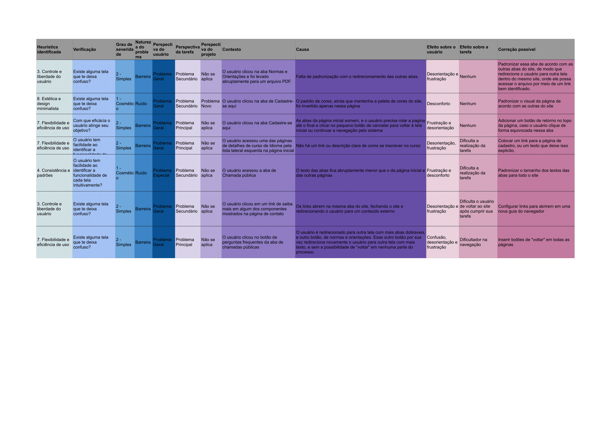
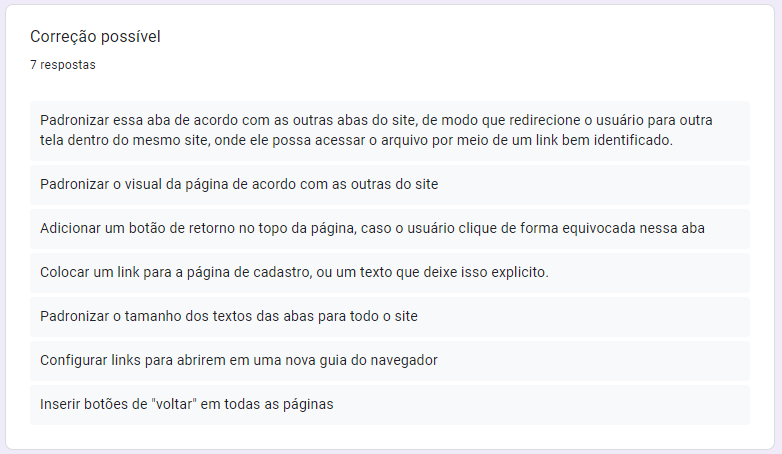

# Avaliação do site

## Formulário de avaliação

Com a finalidade de aplicar os métodos apresentados na página de [Planejamento da avaliação](https://interacao-humano-computador.github.io/2022.2-UnbIdiomas/Design%2C%20Avaliação%20e%20Desenvolvimento/planejamento/), foi criado um formulário com as perguntas a serem respondidas durante a avaliação do site sobre possíveis problemas encontrados. O formulário pode ser acessado pelo link:

- [Clique aqui para acessar o formulário](https://forms.gle/oDb8paomfYsQzZxX6)

## Resultados

Abaixo nas Figuras de 01 a 06 estão os resultados dessa avaliação.

### Resultado geral da avaliação

<figure markdown>

<figcaption>Figura 01 - Cronograma do projeto. Fonte: Autoria própria</figcaption>
</figure>

### Heurísticas encontradas

<figure markdown>

<figcaption>Figura 02 - Heurísticas. Fonte: Autoria própria</figcaption>
</figure>

### Contextos

<figure markdown>

<figcaption>Figura 03 - Contexto. Fonte: Autoria própria</figcaption>
</figure>

### Causas

<figure markdown>

<figcaption>Figura 04 - Causas. Fonte: Autoria própria</figcaption>
</figure>

### Efeitos no usuário

<figure markdown>

<figcaption>Figura 05 - Efeitos. Fonte: Autoria própria</figcaption>
</figure>

### Correções sugeridas

<figure markdown>

<figcaption>Figura 06 - Correções. Fonte: Autoria própria</figcaption>
</figure>

## Histórico de versão

| Versão | Data       | Descrição                   | Autor(es)   | Revisor |
| ------ | ---------- | --------------------------- | ----------- | ------- |
| 1.0    | 23/11/2022 | Adição da página e conteúdo | Eric Chagas | Todos   |

##### Tabela 01 - Histórico de versões. Fonte: Autoria própria