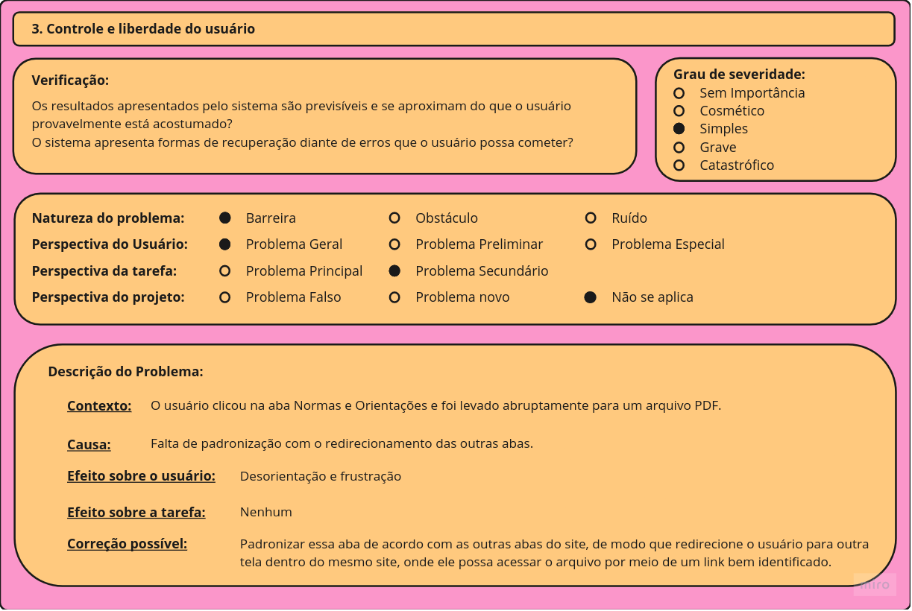
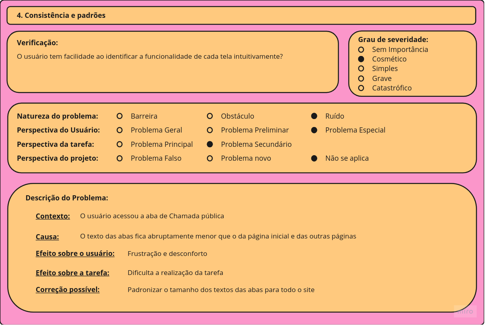
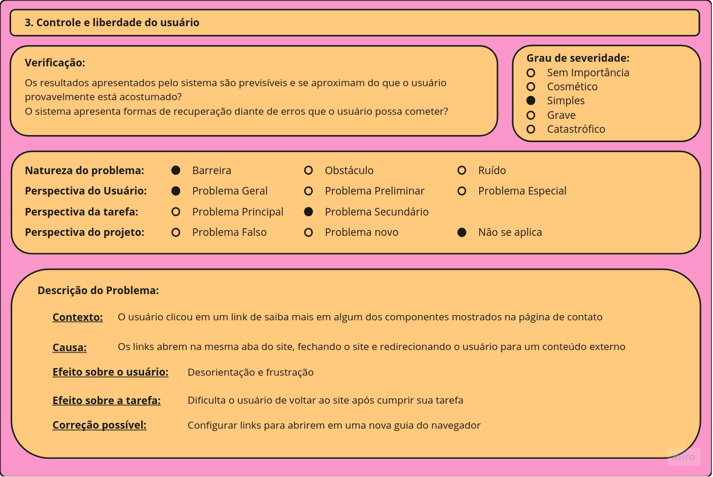

# Avaliação do site

## Formulário de avaliação

Com a finalidade de aplicar os métodos apresentados na página de [Planejamento da avaliação](https://interacao-humano-computador.github.io/2022.2-UnbIdiomas/Design%2C%20Avaliação%20e%20Desenvolvimento/planejamento/), foi criado um formulário com as perguntas a serem respondidas **pelo avaliador** durante a avaliação do site sobre possíveis problemas encontrados. O formulário pode ser acessado pelo link:

- [Clique aqui para acessar o formulário](https://forms.gle/oDb8paomfYsQzZxX6)

## Resultados

A partir desse formulário que facilitou e acelerou extensivamente o processo da avaliação, foram encontrados os pontos de melhoria que podem ser visualizados nas (Figuras de 01 a 07). De forma geral, a maioria dos problemas avaliados foram de usabilidade e recuperação do usuário diante de erros, problemas visuais ou de dificuldade na navegação. Nesse sentido as heurísticas que ficaram evidentes são as seguintes, na (Tabela 01), que apresenta a heurística e o número de aparições dela durante a avaliação:

| Heurística                        | Número de aparições |
|-----------------------------------|---------------------|
| Flexibilidade e eficiência de Uso | 3                   |
| Controle e liberdade do usuário   | 2                   |
| Consistência e padrões            | 1                   |
| Estética e design minimalista     | 1                   |

###### Tabela 01 - Heurísticas encontradas. Fonte: Autoria Própria.

### Formulários preenchidos na avaliação

!!! info "Ferramenta"
    
    Os formulários abaixo foram construídos por meio da ferramenta miro.

<figure markdown>

<figcaption>Figura 01 - Formulário de avaliação. Fonte: Autoria própria</figcaption>
</figure>

<figure markdown>

<figcaption>Figura 02 - Formulário de avaliação. Fonte: Autoria própria</figcaption>
</figure>

<figure markdown>

<figcaption>Figura 03 - Formulário de avaliação. Fonte: Autoria própria</figcaption>
</figure>

<figure markdown>

<figcaption>Figura 04 - Formulário de avaliação. Fonte: Autoria própria</figcaption>
</figure>

<figure markdown>

<figcaption>Figura 05 - Formulário de avaliação. Fonte: Autoria própria</figcaption>
</figure>

<figure markdown>

<figcaption>Figura 06 - Formulário de avaliação. Fonte: Autoria própria</figcaption>
</figure>

<figure markdown>

<figcaption>Figura 07 - Formulário de avaliação. Fonte: Autoria própria</figcaption>
</figure>

## Referências:

>[1] MACIEL, C. et al. Avaliação Heurística de Sítios na Web. Disponível em: <https://www.addlabs.uff.br/Novo_Site_ADDLabs/images/documentos/publicacoes/publicacoes_pdf/trabalhos_anais_congresso/2004/20130809151827_2004%20-%20Avaliao%20heurstica%20de%20stios%20na%20web.pdf>. Acesso em: 23 nov. 2022.

>[2] Disponível em: <https://medium.com/signainfo/entendendo-as-10-heurísticas-de-nielsen-para-melhorar-a-experiência-do-usuário-86f3c14c0586>. Acesso em: 23 nov. 2022.

>[3] UnB idiomas. Disponível em: <http://www.unbidiomas.unb.br>. Acesso em: 23 nov. 2022.

>[4] Entendendo as 10 Heurísticas de Nielsen para melhorar a experiência do usuário.Disponível em: <https://medium.com/signainfo/entendendo-as-10-heurísticas-de-nielsen-para-melhorar-a-experiência-do-usuário-86f3c14c0586>. Acesso em: 23 nov. 2022.

>[5] Disponível em: <https://www.asha.org/siteassets/uploadedFiles/ASHA/Research/EBP/The-DECIDE-Framework.pdf>. Acesso em: 23 nov. 2022b.

## Histórico de versão

| Versão | Data       | Descrição                   | Autor(es)   | Revisor                             |
| ------ | ---------- | --------------------------- | ----------- | ----------------------------------- |
| 1.0    | 23/11/2022 | Adição da página e conteúdo | Eric Chagas | Artur, Eric, Igor, Henrique, Thiago |
| 1.1    | 11/12/2022 | Atualizada a avaliação      | Eric Chagas | Henrique                            |

###### Tabela 02 - Histórico de versões. Fonte: Autoria própria