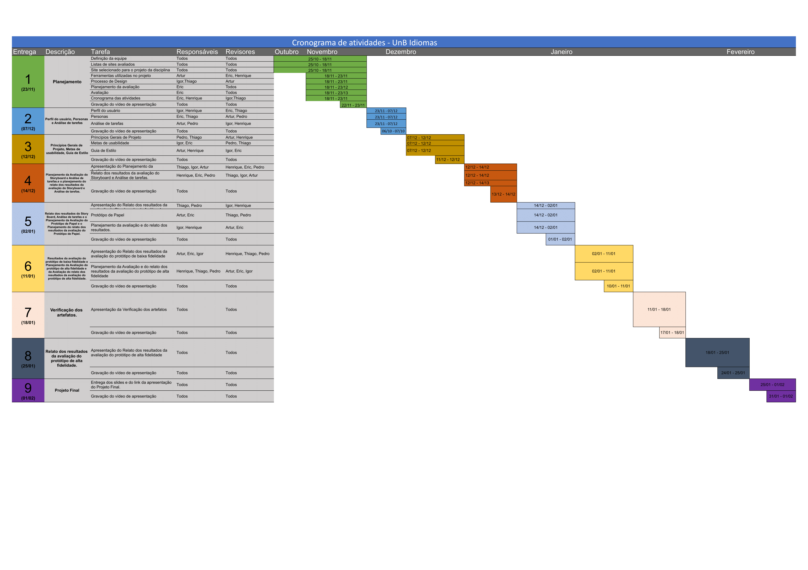
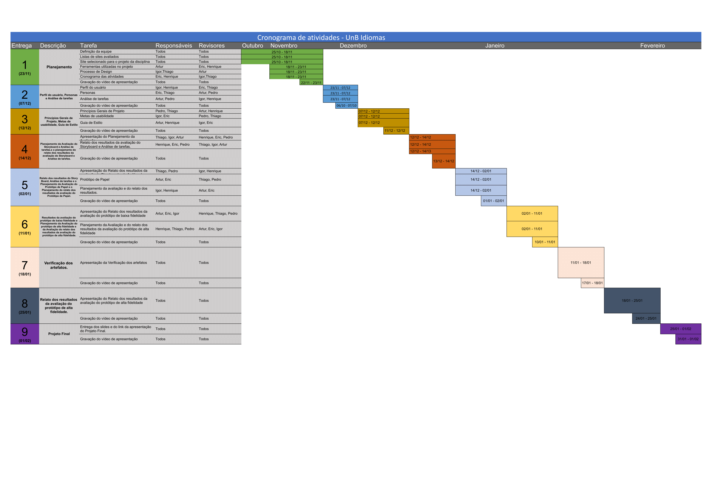
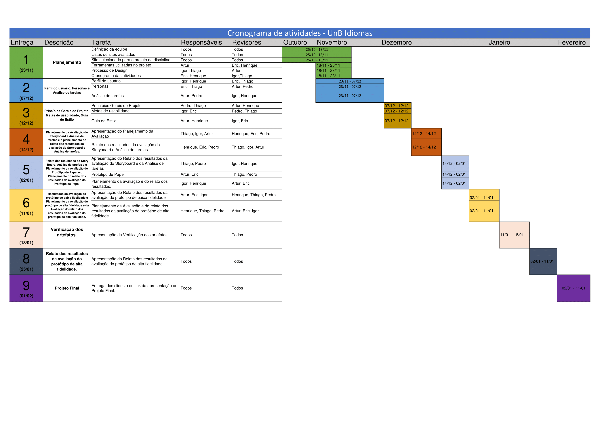
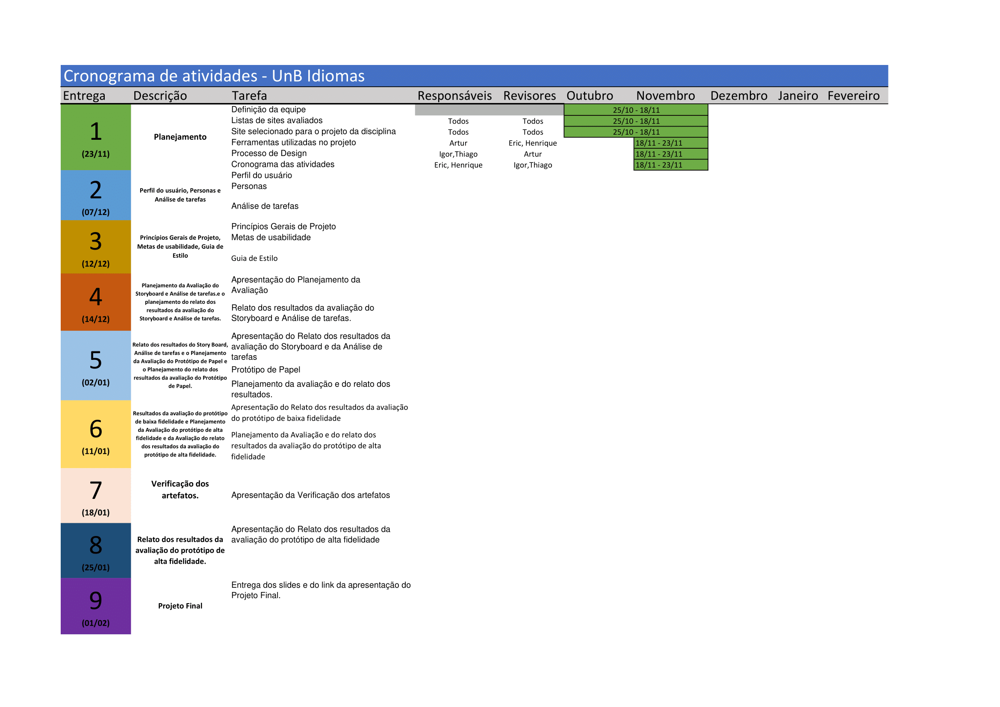

# Cronograma

O cronograma em formato roadmap, mostrado na **Figura 01**, foi desenvolvido com a finalidade de fornecer visibilidade acerca da divisão do trabalho e das entregas que serão realizadas ao longo do projeto.

!!! info "Observações"

    - O cronograma pode ser alterado caso o time julgue necessário
    - É possível navegar pelas versões do cronograma por meio das abas disponíveis acima da imagem
    - Caso durante a evolução do projeto o número de versões torne a navegação pelas abas não intuitiva ou prejudique a visualização, as versões antigas do cronograma passarão a ser mostradas no formato de lista, abaixo da imagem
    
    Desenvolvido por: Eric Chagas de Oliveira

###### Anotação 01 - Observações. Fonte: Autoria própria.

#### É Possível dar zoom no Cronograma mostrado no (Arquivo 01) para visualizar cada uma das atividades com mais detalhes

=== "V7"
  
      <iframe width="100%" height="600" src="../../assets/pdf/roadmapv7.pdf"/>
    ###### Arquivo 01 - Cronograma do projeto. Fonte: Autoria própria.

=== "V6"
  
      <iframe width="100%" height="600" src="../../assets/pdf/roadmapv6.pdf"/>
    ###### Arquivo 02 - Cronograma do projeto v6. Fonte: Autoria própria.

=== "V5"
  
      <iframe width="100%" height="600" src="../../assets/pdf/roadmapv5.pdf"/>
    ###### Arquivo 03 - Cronograma do projeto v5. Fonte: Autoria própria.

=== "V4"
  
      <iframe width="100%" height="600" src="../../assets/pdf/roadmapv4.pdf"/>
    ###### Arquivo 04 - Cronograma do projeto v4. Fonte: Autoria própria.

=== "V3"
    
      <figure markdown>
        
        <figcaption>Figura 01 - Cronograma do projeto. Fonte: Autoria própria</figcaption>
      </figure>

=== "V2"
    
      <figure markdown>
        
        <figcaption>Figura 02 - v2 Cronograma do projeto. Fonte: Autoria própria</figcaption>
      </figure>

=== "V1"
    
      <figure markdown>
        
        <figcaption>Figura 03 - v1 Cronograma do projeto. Fonte: Autoria própria</figcaption>
      </figure>

=== "V0"
    
      <figure markdown>
        
        <figcaption>Figura 04 - v0 do cronograma do projeto. Fonte: Autoria própria</figcaption>
      </figure>

## Cronograma Executado

O cronograma executado pode ser visualizado nas **Tabelas de 01 a 09**, e representa as atividades planejadas e de fato executadas pelos membros descritos.

!!! info "Observações"

    - É possível navegar pelas entregas descritas no cronograma por meio das abas disponíveis acima da tabela. 
    - A nomenclatura das abas segue o seguinte formato:
        - **E1** para a **Entrega 1**
        - **E2** para a **Entrega 2**
        - Assim em diante até a **E9** (Entrega 9) 
    
    Desenvolvido por: Eric Chagas de Oliveira

###### Anotação 02 - Observações. Fonte: Autoria própria.

=== "E1"
          
      | **Tarefa**                                    | **Responsáveis**                    | **Revisores**                       | **Iniciado em** | **Data final de revisão** | **Finalizado em** |
      | --------------------------------------------- | ----------------------------------- | ----------------------------------- | --------------- | ------------------------- | ----------------- |
      | Site selecionado para o projeto da disciplina | Artur, Eric, Igor, Henrique, Thiago | Artur, Eric, Igor, Henrique, Thiago | 25/10/2022      | 18/11/2022                | 18/11/2022        |
      | Processo de Design                            | Igor                                | Artur                               | 18/11/2022      | 23/11/2022                | 23/11/2022        |
      | Planejamento da avaliação                     | Eric                                | Artur, Eric, Igor, Henrique, Thiago | 18/11/2022      | 23/11/2022                | 23/11/2022        |
      | Listas de sites avaliados                     | Artur, Eric, Igor, Henrique, Thiago | Artur, Eric, Igor, Henrique, Thiago | 25/10/2022      | 18/11/2022                | 18/11/2022        |
      | Ferramentas utilizadas no projeto             | Artur                               | Eric, Henrique                      | 18/11/2022      | 23/11/2022                | 23/11/2022        |
      | Definição da equipe                           | Artur, Eric, Igor, Henrique, Thiago | Artur, Eric, Igor, Henrique, Thiago | 25/10/2022      | 18/11/2022                | 18/11/2022        |
      | Cronograma das atividades                     | Eric, Henrique                      | Igor,Thiago                         | 18/11/2022      | 23/11/2022                | 23/11/2022        |
      | Avaliação                                     | Eric                                | Artur, Eric, Igor, Henrique, Thiago | 18/11/2022      | 23/11/2022                | 23/11/2022        |
      | Metodologia                                   | Thiago                              | Eric                                | 18/11/2022      | 23/11/2022                | 23/11/2022        |
      | Gravação do vídeo de apresentação             | Artur, Eric, Igor, Henrique, Thiago | Artur, Eric, Igor, Henrique, Thiago | 22/11/2022      | 23/11/2022                | 23/11/2022        |

    ###### Tabela 01 - Atividades executadas na entrega 1. Fonte: Autoria própria

=== "E2"
          
      | **Tarefa**                                   | **Responsáveis**              | **Revisores**                 | **Iniciado em** | **Data final de revisão** | **Finalizado em** |
      | -------------------------------------------- | ----------------------------- | ----------------------------- | --------------- | ------------------------- | ----------------- |
      | Perfil do usuário                            | Artur                         | Henrique                      | 01/12           | 06/12                     | 07/12             |
      | Personas                                     | Henrique                      | Eric                          | 01/12           | 06/12                     | 07/12             |
      | Análise de tarefas                           | Eric, Thiago                  | Thiago, Artur                 | 01/12           | 06/12                     | 07/12             |
      | Políticas de branches e commits              | Artur                         | Henrique                      | 01/12           | 06/12                     | 07/12             |
      | Retrabalho: Planejamento e avaliação do site | Eric                          | Henrique                      | 01/12           | 06/12                     | PENDENTE          |
      | Retrabalho: Processo de design               | Igor                          | Thiago                        | 01/12           | 06/12                     | PENDENTE          |
      | Retrabalho: Metodologia                      | Thiago                        | Eric                          | 01/12           | 06/12                     | PENDENTE             |
      | Retrabalho: Lista de sites avaliados         | Thiago                        | Eric                          | 01/12           | 06/12                     | PENDENTE             |
      | Retrabalho: Cronograma                       | Eric                          | Henrique                      | 01/12           | 06/12                     | 07/12             |
      | Retrabalho: Atas de reunião                  | Henrique                      | Eric                          | 01/12           | 06/12                     | 07/12             |
      | Gravação do vídeo de apresentação            | Artur, Eric, Henrique, Thiago | Artur, Eric, Henrique, Thiago | 07/12           | 07/12                     | 07/12             |

    ###### Tabela 02 - Atividades executadas na entrega 2. Fonte: Autoria própria

=== "E3"
          
      | **Tarefa**                                   | **Responsáveis**                    | **Revisores**                       | **Iniciado em** | **Data final de revisão** | **Finalizado em** |
      | -------------------------------------------- | ----------------------------------- | ----------------------------------- | --------------- | ------------------------- | ----------------- |
      | Princípios Gerais de Projeto                 | Thiago                              | Eric                                | 07/12           | 11/12                     | 12/12             |
      | Metas de usabilidade                         | Eric                                | Thiago                              | 07/12           | 11/12                     | 12/12             |
      | Guia de Estilo                               | Henrique, Artur                     | Eric, Igor                          | 07/12           | 11/12                     | 12/12             |
      | Aspectos éticos                              | Igor                                | Artur, Henrique                     | 07/12           | 11/12                     | 12/12             |
      | Atualização: Atas de reunião                 | Henrique                            | Eric, Artur, Igor                   | 07/12           | 11/12                     | 12/12             |
      | Atualização: Cronograma                      | Eric                                | Henrique                            | 07/12           | 11/12                     | 12/12             |
      | Retrabalho: Planejamento e avaliação do site | Eric                                | Henrique                            | 07/12           | 11/12                     | 12/12             |
      | Retrabalho: Processo de design               | Eric                                | Igor                                | 07/12           | 11/12                     | 12/12             |
      | Retrabalho: Metodologia                      | Eric                                | Thiago                              | 07/12           | 11/12                     | 12/12             |
      | Retrabalho: Lista de sites avaliados         | Eric                                | Thiago                              | 07/12           | 11/12                     | 12/12             |
      | Gravação do vídeo de apresentação            | Artur, Eric, Henrique, Thiago, Igor | Artur, Eric, Henrique, Thiago, Igor | 12/12           | 12/12                     | 12/12             |

    ###### Tabela 03 - Atividades executadas na entrega 3. Fonte: Autoria própria

=== "E4"
          
      | **Tarefa**                                                               | **Responsáveis**                    | **Revisores**                       | **Iniciado em** | **Data final de revisão** | **Finalizado em** |
      | ------------------------------------------------------------------------ | ----------------------------------- | ----------------------------------- | --------------- | ------------------------- | ----------------- |
      | Planejamento da Avaliação da Análise de Tarefas                          | Igor, Thiago                        | Eric, Henrique                      | 12/12           | 13/12                     | 14/12             |
      | Planejamento da Avaliação do Storyboard                                  | Henrique                            | Thiago, Igor, Artur                 | 12/12           | 13/12                     | 14/12             |
      | Planejamento do Relato dos resultados da avaliação da Análise de tarefas | Artur                               | Eric, Henrique                      | 12/12           | 13/12                     | 14/12             |
      | Planejamento do Relato dos resultados da avaliação do Storyboard         | Eric                                | Thiago, Igor, Artur                 | 12/12           | 13/12                     | 14/12             |
      | Atualização: Cronograma                                                  | Eric                                | Henrique                            | 14/12           | 14/12                     | 14/12             |
      | Gravação do vídeo de apresentação                                        | Artur, Eric, Henrique, Thiago, Igor | Artur, Eric, Henrique, Thiago, Igor | 14/12           | 14/12                     | 14/12             |

    ###### Tabela 04 - Atividades executadas na entrega 4. Fonte: Autoria própria

=== "E5"
          
      | **Tarefa**                                                                                 | **Responsáveis**                    | **Revisores**                       | **Iniciado em** | **Data final de revisão** | **Finalizado em** |
      | ------------------------------------------------------------------------------------------ | ----------------------------------- | ----------------------------------- | --------------- | ------------------------- | ----------------- |
      | Apresentação do Relato dos resultados da  avaliação do Storyboard e da Análise de  tarefas |                                     |                                     |                 |                           |                   |
      | Protótipo de Papel                                                                         |                                     |                                     |                 |                           |                   |
      | Planejamento da avaliação e do relato dos resultados.                                      |                                     |                                     |                 |                           |                   |
      | Atualização: Atas de reunião                                                               | Henrique                            | Eric, Artur, Igor                   |                 |                           |                   |
      | Atualização: Cronograma                                                                    | Eric                                | Henrique                            | 21/12           | 21/12                     | 21/12             |
      | Gravação do vídeo de apresentação                                                          | Artur, Eric, Henrique, Thiago, Igor | Artur, Eric, Henrique, Thiago, Igor | 21/12           | 21/12                     | 21/12             |

    ###### Tabela 05 - Atividades executadas na entrega 5. Fonte: Autoria própria

=== "E6"
          
      | **Tarefa**                                                                                        | **Responsáveis**                    | **Revisores**                       | **Iniciado em** | **Data final de revisão** | **Finalizado em** |
      | ------------------------------------------------------------------------------------------------- | ----------------------------------- | ----------------------------------- | --------------- | ------------------------- | ----------------- |
      | Apresentação do Relato dos resultados da avaliação do protótipo de baixa fidelidade               |                                     |                                     |                 |                           |                   |
      | Planejamento da Avaliação e do relato dos resultados da avaliação do protótipo de alta fidelidade |                                     |                                     |                 |                           |                   |
      | Atualização: Atas de reunião                                                                      | Henrique                            | Eric, Artur, Igor                   |                 |                           |                   |
      | Atualização: Cronograma                                                                           | Eric                                | Henrique                            | 11/01           | 11/01                     | 11/01             |
      | Gravação do vídeo de apresentação                                                                 | Artur, Eric, Henrique, Thiago, Igor | Artur, Eric, Henrique, Thiago, Igor | 11/01           | 11/01                     | 11/01             |

    ###### Tabela 06 - Atividades executadas na entrega 6. Fonte: Autoria própria

=== "E7"
          
      | **Tarefa**                                | **Responsáveis**                    | **Revisores**                       | **Iniciado em** | **Data final de revisão** | **Finalizado em** |
      | ----------------------------------------- | ----------------------------------- | ----------------------------------- | --------------- | ------------------------- | ----------------- |
      | Apresentação da Verificação dos artefatos |                                     |                                     |                 |                           |                   |
      | Atualização: Atas de reunião              | Henrique                            | Eric, Artur, Igor                   |                 |                           |                   |
      | Atualização: Cronograma                   | Eric                                | Henrique                            | 18/01           | 18/01                     | 18/01             |
      | Gravação do vídeo de apresentação         | Artur, Eric, Henrique, Thiago, Igor | Artur, Eric, Henrique, Thiago, Igor |    18/01             |                  18/01         |               18/01    |

    ###### Tabela 07 - Atividades executadas na entrega 7. Fonte: Autoria própria

=== "E8"
          
      | **Tarefa**                                                                         | **Responsáveis**                    | **Revisores**                       | **Iniciado em** | **Data final de revisão** | **Finalizado em** |
      | ---------------------------------------------------------------------------------- | ----------------------------------- | ----------------------------------- | --------------- | ------------------------- | ----------------- |
      | Apresentação do Relato dos resultados da avaliação do protótipo de alta fidelidade |                                     |                                     |                 |                           |                   |
      | Atualização: Atas de reunião                                                       | Henrique                            | Eric, Artur, Igor                   |                 |                           |                   |
      | Atualização: Cronograma                                                            | Eric                                | Henrique                            | 25/01           | 25/01                     | 25/01             |
      | Gravação do vídeo de apresentação                                                  | Artur, Eric, Henrique, Thiago, Igor | Artur, Eric, Henrique, Thiago, Igor | 25/01           | 25/01                     | 25/01             |

    ###### Tabela 08 - Atividades executadas na entrega 8. Fonte: Autoria própria

=== "E9"
        
    | **Tarefa**                                                     | **Responsáveis**                    | **Revisores**                       | **Iniciado em** | **Data final de revisão** | **Finalizado em** |
    | -------------------------------------------------------------- | ----------------------------------- | ----------------------------------- | --------------- | ------------------------- | ----------------- |
    | Entrega dos slides e do link da apresentação do Projeto Final. |                                     |                                     |                 |                           |                   |
    | Atualização: Atas de reunião                                   | Henrique                            | Eric, Artur, Igor                   |                 |                           |                   |
    | Atualização: Cronograma                                        | Eric                                | Henrique                            | 01/02           | 01/02                     | 01/02             |
    | Gravação do vídeo de apresentação                              | Artur, Eric, Henrique, Thiago, Igor | Artur, Eric, Henrique, Thiago, Igor | 01/02           | 01/02                     | 01/02             |

    ###### Tabela 09 - Atividades executadas na entrega 9. Fonte: Autoria própria

## Histórico de versões

|    Data    | Versão |                                    Descrição                                    |                                            Autor(es)                                             | Revisores    |
| :--------: | :----: | :-----------------------------------------------------------------------------: | :----------------------------------------------------------------------------------------------: | ------------ |
| 20/11/2022 |  1.0   |                      Criação da página e v0 do cronograma                       | [@Eric-chagas](https://github.com/Eric-chagas)   [@hgaldino05](https://github.com/hgaldino05) | Igor, Thiago |
| 21/11/2022 |  1.1   |                        Atualização para v1 do cronograma                        |                          [@Eric-chagas](https://github.com/Eric-chagas)                          | Igor, Thiago |
| 22/11/2022 |  1.2   |                Adição do versionamento do cronograma e legendas                 |                          [@Eric-chagas](https://github.com/Eric-chagas)                          | Igor, Thiago |
| 23/11/2022 |  1.3   |          Adição da v2 do cronograma e tabelas de atividades executadas          |                          [@Eric-chagas](https://github.com/Eric-chagas)                          | Igor, Thiago |
| 23/11/2022 |  1.4   |          Adição da v3 do cronograma e tabelas de atividades executadas          |                          [@Eric-chagas](https://github.com/Eric-chagas)                          | Igor, Thiago |
| 07/12/2022 |  1.5   |          Adição da v4 do cronograma e tabelas de atividades executadas          |                          [@Eric-chagas](https://github.com/Eric-chagas)                          | Henrique     |
| 08/12/2022 |  1.6   |                Atualização no cronograma executado da entrega 2                 |                          [@Eric-chagas](https://github.com/Eric-chagas)                          | Henrique     |
| 12/12/2022 |  1.7   |        Atualização no cronograma e do cronograma executado da entrega 3         |                          [@Eric-chagas](https://github.com/Eric-chagas)                          | Henrique     |
| 14/12/2022 |  1.8   |        Atualização no cronograma e do cronograma executado da entrega 4         |                          [@Eric-chagas](https://github.com/Eric-chagas)                          | Henrique     |
| 14/12/2022 |  1.9   | Atualização para roadmap v7 e melhorias no cronograma e no cronograma executado |                          [@Eric-chagas](https://github.com/Eric-chagas)                          | Henrique     |

###### Tabela 10 - Histórico de versões. Fonte: Autoria própria

